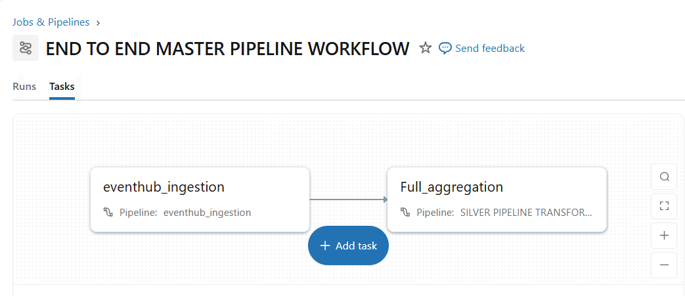
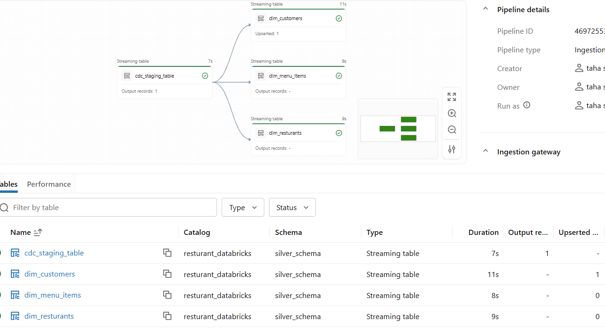
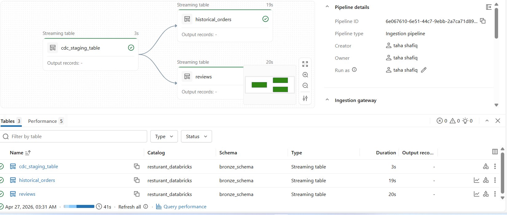
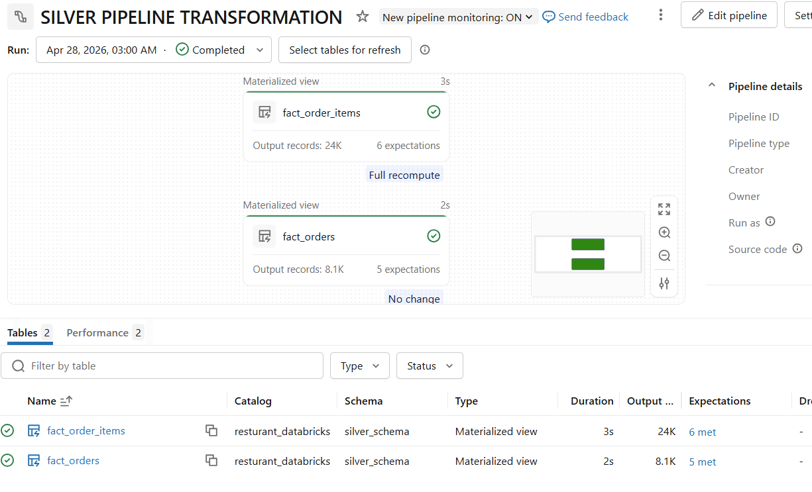
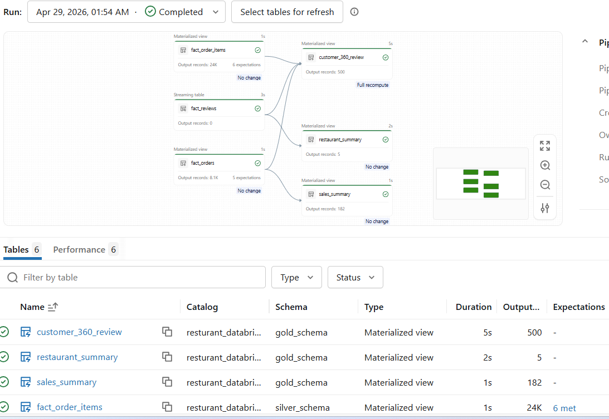
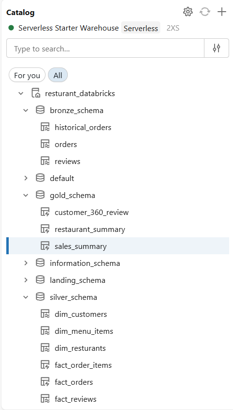
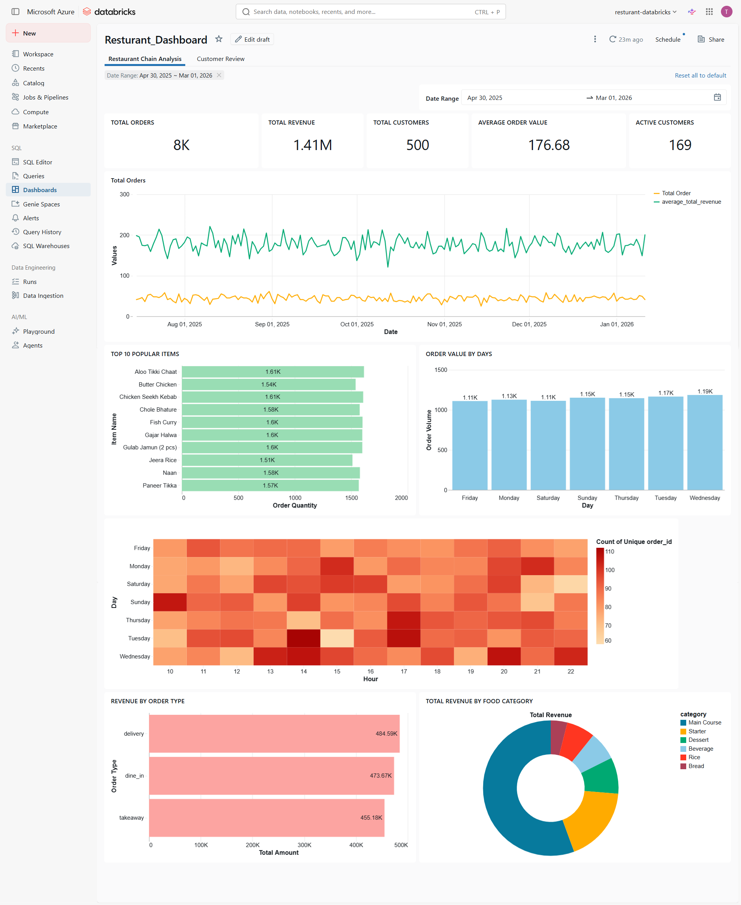
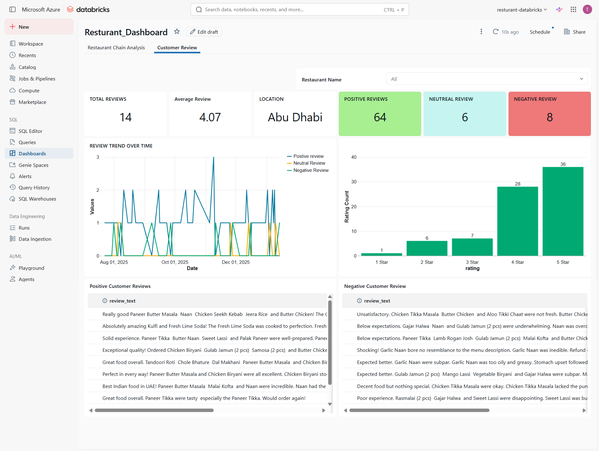

# Restaurant Chain Databricks Lakehouse

End-to-end lakehouse pipeline for a restaurant chain using Azure Event Hubs + SQL Server (CDC/CT) into Databricks Unity Catalog. The project ingests historical + streaming data, builds silver facts, produces gold aggregates, applies AI sentiment analysis, and powers two BI dashboards.

## Architecture (High Level)

- **Sources**
  - **Azure Event Hubs**: real-time `orders` stream
  - **SQL Server**: historical orders + reviews + dimension data (customers, restaurants, menu items)
- **Ingestion**
  - **Lakeflow Connect** (classic compute): CDC/CT ingestion from SQL Server
  - **Spark Declarative Pipelines (DLT)**: streaming from Event Hubs
- **Lakehouse Layers**
  - **Bronze**: raw streaming orders + CDC/CT raw tables
  - **Silver**: cleaned dimensions + fact tables
  - **Gold**: business aggregates for dashboards
- **AI**
  - Mosaic AI `ai_query` sentiment extraction on reviews



## Data Sources

### SQL Server (CDC + Change Tracking)
Tables and CDC/CT setup are defined in:
- [data_generation/sql/database_setup.sql](data_generation/sql/database_setup.sql)

Key tables:
- `historical_orders`
- `reviews`
- `customers`
- `menu_items`
- `restaurants`

Utility script for Lakeflow permissions + CDC enablement:
- [data_generation/sql/utility_script.sql](data_generation/sql/utility_script.sql)



### Event Hubs (Streaming Orders)
- Producer: [data_generation/order_generation.py](data_generation/order_generation.py)
- Consumer (DLT): [databricks_pipeline/eventhub_ingestion.py](databricks_pipeline/eventhub_ingestion.py)



## Pipeline Layers

### Bronze Layer
- **Streaming orders** from Event Hubs into Unity Catalog
  - [databricks_pipeline/eventhub_ingestion.py](databricks_pipeline/eventhub_ingestion.py)
- **Historical orders + reviews** from SQL Server via Lakeflow Connect

### Silver Layer
Facts and curated tables with expectations and parsing logic:
- **Fact Orders** (order-level)
  - [databricks_pipeline/silver_transformation/fact_order_transforamtion.py](databricks_pipeline/silver_transformation/fact_order_transforamtion.py)
- **Fact Order Items** (line-level)
  - [databricks_pipeline/silver_transformation/fact_order_item.py](databricks_pipeline/silver_transformation/fact_order_item.py)
- **Fact Reviews** with AI sentiment extraction
  - [databricks_pipeline/silver_transformation/fact_reviews_transformation.sql](databricks_pipeline/silver_transformation/fact_reviews_transformation.sql)



### Gold Layer
Aggregations and business-friendly tables:
- **Customer 360 Profile**
  - [databricks_pipeline/gold_transforamtion/customer_profile.py](databricks_pipeline/gold_transforamtion/customer_profile.py)
- **Daily Sales & Revenue**
  - [databricks_pipeline/gold_transforamtion/daily_sales_reveneue.py](databricks_pipeline/gold_transforamtion/daily_sales_reveneue.py)
- **Restaurant Review Summary**
  - [databricks_pipeline/gold_transforamtion/restaurant_review.py](databricks_pipeline/gold_transforamtion/restaurant_review.py)



## AI Sentiment Analysis (Mosaic AI)

Review sentiment and issue extraction is done using Databricks `ai_query`:
- DLT implementation: [databricks_pipeline/silver_transformation/fact_reviews_transformation.sql](databricks_pipeline/silver_transformation/fact_reviews_transformation.sql)
- Reference query: [data_generation/sql/ai_analysis_query.sql](data_generation/sql/ai_analysis_query.sql)

## Unity Catalog + Governance

Lakehouse objects are managed through Unity Catalog.



## Dashboards

Two dashboards are built from gold tables:

1) **Restaurant Analysis**



2) **Reviews & Customer Analysis**



## Environment Setup (Local Generator)

> Used to generate streaming order events only.

```powershell
python -m venv venv
venv\Scripts\Activate.ps1
pip install -r data_generation\requirements.txt
```

Create a `.env` in the project root (or copy `.env.example`) with:

```
EVENTHUB_CONNECTION_STRING=...
EVENTHUB_NAME=...
```

Start streaming orders:

```powershell
python data_generation\order_generation.py
```

## Notes

- Lakeflow Connect uses classic compute for CDC/CT ingestion.
- Silver tables enforce expectations (null checks, payment method validation).
- Gold tables are built with DLT materialized views for analytics.

## Screenshots Index

- [pipeline_performance_screenshots/Master_pipeline.png](pipeline_performance_screenshots/Master_pipeline.png)
- [pipeline_performance_screenshots/CDC_enabled_ingestion.png](pipeline_performance_screenshots/CDC_enabled_ingestion.png)
- [pipeline_performance_screenshots/gateway_ingestion.png](pipeline_performance_screenshots/gateway_ingestion.png)
- [pipeline_performance_screenshots/silver_transformation.png](pipeline_performance_screenshots/silver_transformation.png)
- [pipeline_performance_screenshots/transformation.png](pipeline_performance_screenshots/transformation.png)
- [pipeline_performance_screenshots/unity_Catalog.png](pipeline_performance_screenshots/unity_Catalog.png)
- [Dashboard/Restaurant_analysis.png](Dashboard/Restaurant_analysis.png)
- [Dashboard/Reviews_analysis.png](Dashboard/Reviews_analysis.png)
